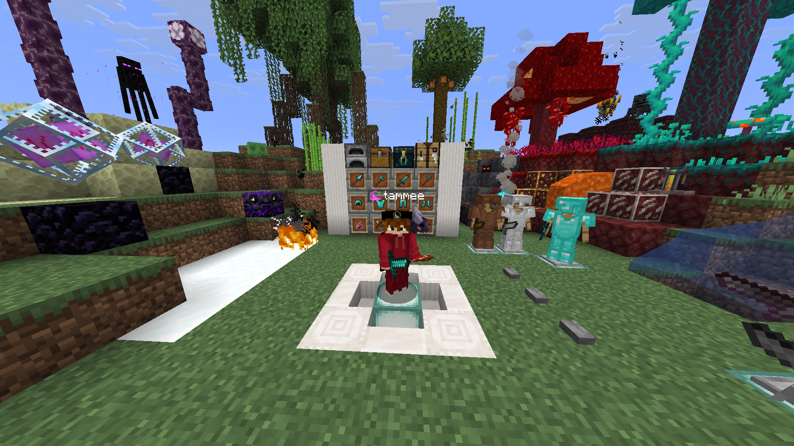

# tammee's Texture Pack

A quality-of-life resource pack for Minecraft Java Edition — built for survival, SMP, and PVP, but also keeping the vanilla look of the game!

---

## What's Included

| | Category | Description |
|---|---|---|
| ⚔️ | **Swords** | Custom textures for all sword types improving pvp (wood through netherite + copper) |
| ⛏️ | **Ores** | Ore out line textures for all types, including deepslate variants and nether ores |
| 🖥️ | **GUI** | Cleaner inventory, dark mode UI, and potion brewing instructions |
| 🌾 | **Crops** | Updated growth stage textures (carrots, potatoes, wheat, beetroot) |
| 🧱 | **Blocks** | Select block updates (wool colors, saplings, flowers, and more) |
| ✨ | **Particles** | Smaller totem of undying, and less totem pop particle effect, making it good for pvp |
| 🔊 | **Sounds** | Custom sound overrides that limits cave and rain sounds |
| 👉 | **There is more** | This pack is made for pvp, and inculde much more usefull changes to the game! |

---

## Version Support

Uses overlays to handle version differences automatically — no manual switching needed.

| Minecraft Version | Pack Format | Status |
|---|---|---|
| 1.26.2 | latest | ✅ Supported |
| 1.21.x | 42 – 75 | ✅ Supported |
| 1.20.5 – 1.20.6 | 34 | ✅ Supported |

---

## How to use

> Requires **Minecraft Java Edition 1.20.5** or newer.

1. **Download** the `.zip` from the releases page
2. **Place** the `.zip` (do **extract** it) (make sure there **no double directorys**) put it into your `resourcepacks` folder:

   | OS | Path |
   |---|---|
   | Windows | `%appdata%\.minecraft\resourcepacks` |
   | macOS | `~/Library/Application Support/minecraft/resourcepacks` |
   | Linux | `~/.minecraft/resourcepacks` |

3. **Enable** it in-game via **Options → Resource Packs**

---

## Credits

Built from [Vanilla Tweaks](https://vanillatweaks.net) with more community packs mixed in for pvp textures. Credit goes to all original pack authors.

## License

See [MIT LICENSE](LICENSE).
